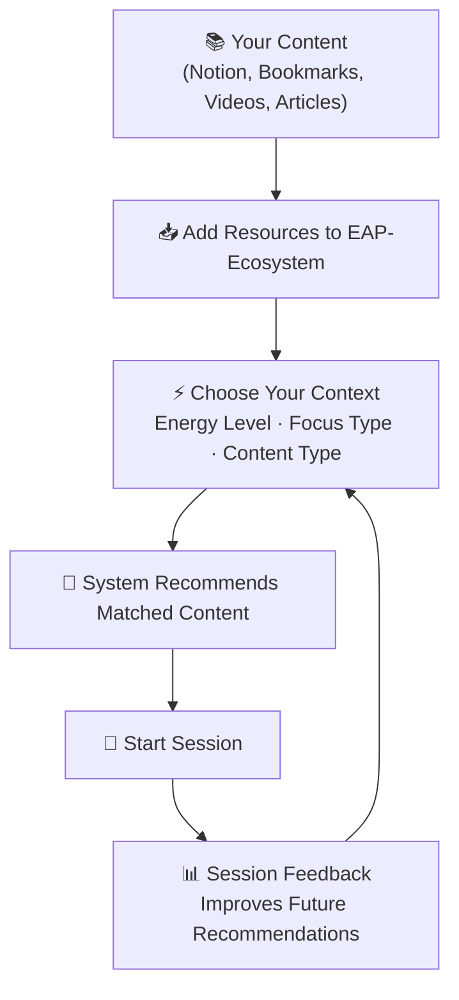
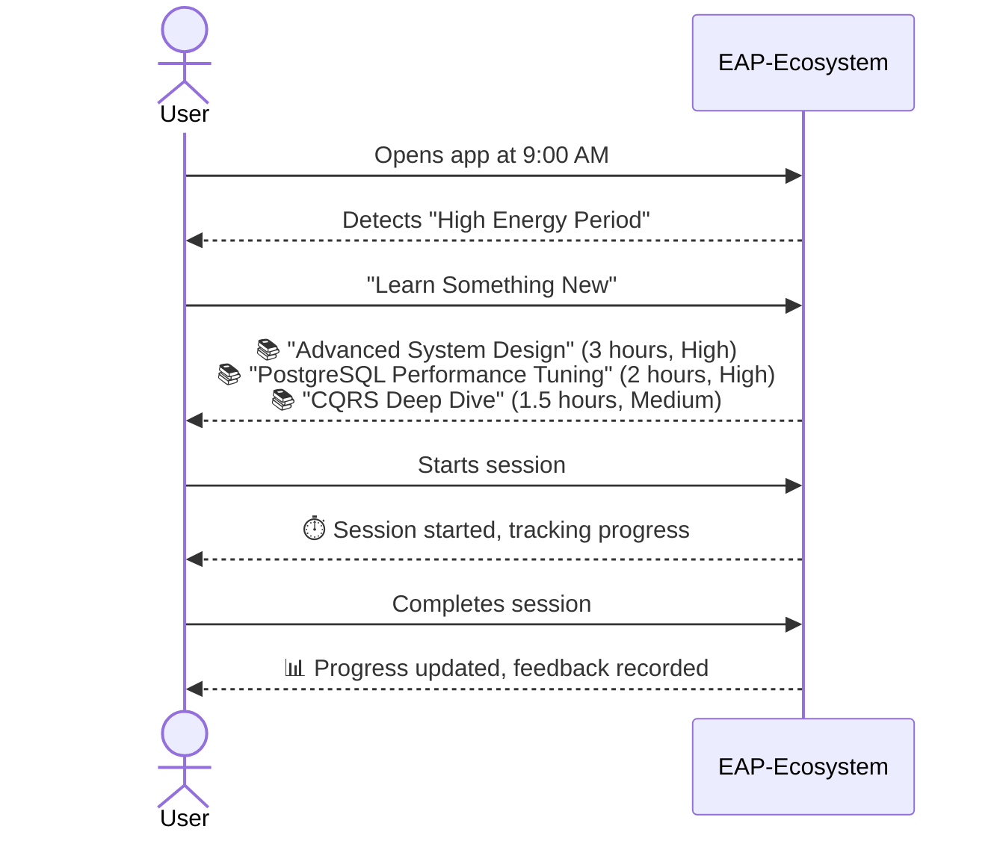
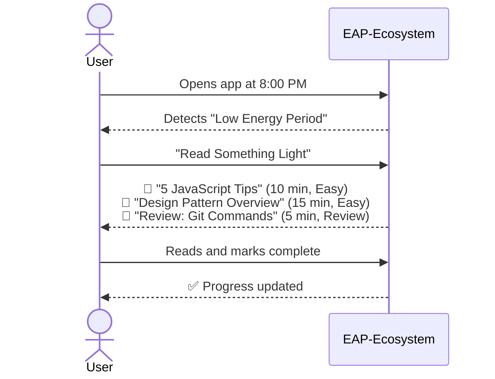

# EAP-Ecosystem

> **E**cosistema de **A**prendizaje **P**ersonal  
> A comprehensive personal learning ecosystem built with modern architectural principles to optimize your learning journey based on energy levels, focus, and content management.

[](https://www.typescriptlang.org/)
[](https://nodejs.org/)
[](https://yarnpkg.com/)
[](https://vitest.dev/)
[](https://developer.mozilla.org/en-US/docs/Web/JavaScript/Guide/Modules)

[](https://8thlight.com/blog/uncle-bob/2012/08/13/the-clean-architecture.html)
[](https://alistair.cockburn.us/hexagonal-architecture/)
[](https://www.domainlanguage.com/ddd/)

[](https://www.conventionalcommits.org/)
[](https://github.com/ThiagoDelgado-D/EAP-Ecosystem/releases)
[](LICENSE)

[](https://github.com/ThiagoDelgado-D/EAP-Ecosystem)
[](https://github.com/ThiagoDelgado-D/EAP-Ecosystem/issues)
[](https://github.com/ThiagoDelgado-D/EAP-Ecosystem/commits/main)

---

## 🎯 What Problem Does This System Solve?

### The Challenge

As a continuous learner, you face several daily challenges:

1. **Scattered Content**: Learning materials spread across Notion databases, browser bookmarks, saved videos, articles, and courses
2. **Decision Paralysis**: Hundreds of micro-decisions about what to consume next
3. **Energy Mismatch**: Attempting difficult technical content when your cognitive energy is low
4. **Habit Inconsistency**: Struggling to maintain consistent reading and learning habits
5. **Context Blindness**: Not knowing if you should study, read, practice, or review at any given moment

### The Solution

**EAP-Ecosystem** is your personal learning companion that:



---

## 💡 Core Philosophy

This system is built on three fundamental pillars:

### 1. **Cognitive Energy Optimization**

Not all hours are equal. Your brain has different capacities throughout the day:

- **High Energy (Morning)**: Complex technical content, deep learning
- **Medium Energy (Afternoon)**: Practice, code reviews, medium difficulty
- **Low Energy (Evening)**: Light reading, reviews, casual learning

### 2. **Intentional Learning**

Move from reactive consumption to intentional learning:

- **Before**: "What video should I watch now?" (Random browsing)
- **After**: "I have medium energy and want to learn → System suggests appropriate content"

### 3. **Habit Building Through Friction Reduction**

- Remove decision fatigue
- Provide clear next actions
- Track progress automatically
- Celebrate consistency

---

## 🌟 Key Features

### Current (v0.1)

✅ **Learning Resource Management**

- Store and categorize learning materials (videos, articles, courses, books)
- Tag resources by topic, difficulty, and required energy level
- Track status: Pending, In Progress, Completed

✅ **Intelligent Resource Filtering**

- Filter by difficulty level (Low, Medium, High)
- Filter by energy requirement (Low, Medium, High)
- Filter by topic or resource type
- Combine multiple filters for precise suggestions

✅ **Progress Tracking**

- Mark resources as viewed
- Track completion status
- Estimated duration vs actual duration

### Planned (Future Releases)

🚀 **Energy-Based Recommendations**

```typescript
User Input: "I have medium energy, want to learn something new"
System Output: "Here are 3 technical articles (30-45 min each) that match your profile"
```

🚀 **Smart Session Management**

- Start focused learning sessions
- Track time and engagement
- Provide session feedback to improve future recommendations

🚀 **Habit Analytics**

- Daily reading streaks
- Energy level patterns throughout the day
- Optimal learning time detection
- Content consumption patterns

🚀 **Integration Ecosystem**

- Import from Notion databases
- Sync browser bookmarks
- Pocket integration
- YouTube Watch Later integration

🚀 **Adaptive Learning Algorithm**

- Learn from your feedback
- Adjust recommendations based on completion rates
- Detect your preferences automatically

---

## 🏗️ Architecture

This project implements a **Module-Based Architecture** where each part of the system is divided into **bounded contexts**:

```
EAP-Ecosystem/
│
├── shared/                    # Cross-cutting concerns
│   ├── domain-lib/           # Shared types, errors, validations
│   └── infrastructure-lib/    # Shared service implementations
│
├── learning-resource/         # Module: Learning Resource Management
│   ├── domain/               # Business entities and rules
│   ├── application/          # Use cases and orchestration
│   └── infrastructure/       # Database, external services
│
├── user/                     # Module: User Management
│   ├── domain/
│   ├── application/
│   └── infrastructure/
│
└── recommendation/           # Module: Smart Recommendations
    ├── domain/
    ├── application/
    └── infrastructure/
```

### Hexagonal Architecture Per Module

Each module applies **Hexagonal Architecture (Ports & Adapters)**:

```
        ┌─────────────────────────────┐
        │    Primary Adapters         │
        │   (REST API / CLI / UI)     │
        └─────────────┬───────────────┘
                      │
        ┌─────────────▼───────────────┐
        │      Application Layer      │
        │       (Use Cases)           │
        └─────────────┬───────────────┘
                      │
        ┌─────────────▼───────────────┐
        │       Domain Layer          │
        │     (Business Logic)        │
        └─────────────┬───────────────┘
                      │
        ┌─────────────▼───────────────┐
        │   Secondary Adapters        │
        │  (Database / Cache / API)   │
        └─────────────────────────────┘
```

### The Role of `shared/`

The `shared/` directory contains **transversal code** used across multiple modules:

**Philosophy**:

> "If you detect that code is repeated in multiple places, adapt it into `shared/` to simplify flows and avoid code duplication"

**What Lives in `shared/`**:

- ✅ Base entity types (`Entity`, `TimestampedEntity`)
- ✅ Common errors (`InvalidDataError`, `NotFoundError`)
- ✅ Shared types (`UUID`, `ValidationResult`)
- ✅ Service interfaces and implementations (`CryptoService`)
- ✅ Validation framework (consolidating)
- ✅ Utility functions used across domains

**What Does NOT Live in `shared/`**:

- ❌ Business logic specific to one domain
- ❌ Use cases
- ❌ Domain entities (those belong to their module)

---

## 🚀 Getting Started

### Prerequisites

- **Node.js**: v20.x or higher
- **Yarn**: 4.9.2 (included via Corepack)
- **TypeScript**: 5.9.3

### Installation

```bash
# Clone the repository
git clone https://github.com/ThiagoDelgado-D/EAP-Ecosystem
cd EAP-Ecosystem

# Install dependencies
yarn install

# Build all workspaces
yarn build
```

### Running Tests

```bash
# All tests
yarn test

# Tests with coverage
yarn test:coverage

# Pre-PR validation
yarn pre-pr
```

### Seed Development Data

```bash
# Generate local JSON data files
yarn seed
```

---

## 📦 Current Modules

### Learning Resource Module

**Purpose**: Manage your learning content library

**Entities**:

- `LearningResource`: Individual learning item (video, article, course)
- `Topic`: Categories for resources (Programming, Design, Science)
- `ResourceType`: Type of content (Video, Article, Book, Course)

**Use Cases**:

```typescript
// Add a new resource
await addResource(deps, {
  title: "Clean Architecture Fundamentals",
  url: "https://example.com/course",
  difficulty: DifficultyType.MEDIUM,
  energyLevel: EnergyLevelType.MEDIUM,
  estimatedDurationMinutes: 180,
  topicIds: [topicId],
  resourceTypeId: typeId,
});

// Get recommendations based on filters
const { resources } = await getResourcesByFilter(deps, {
  filters: {
    difficulty: DifficultyType.LOW,
    energyLevel: EnergyLevelType.LOW,
    status: ResourceStatusType.PENDING,
  },
});
```

**Key Features**:

- ✅ Energy level auto-suggestion based on difficulty + duration
- ✅ Multiple filtering options
- ✅ Progress tracking
- ✅ Flexible updates
- ✅ Complete test coverage

---

## 🎨 User Experience Flow (Planned)

### Morning Session (High Energy)



### Evening Session (Low Energy)



---

## 🛠️ Technology Stack

| Category            | Technology           | Purpose                              |
| ------------------- | -------------------- | ------------------------------------ |
| **Language**        | TypeScript 5.9       | Type safety and developer experience |
| **Package Manager** | Yarn 4.9 (Berry)     | Workspaces and performance           |
| **Testing**         | Vitest 4.0           | Fast unit testing                    |
| **API Framework**   | NestJS               | Enterprise REST API                  |
| **Frontend**        | Angular (Planned)    | Robust SPA framework                 |
| **Database**        | PostgreSQL (Planned) | Relational data storage              |
| **Cache**           | Redis (Planned)      | Performance optimization             |
| **Architecture**    | Clean + Hexagonal    | Maintainability and testability      |
| **Patterns**        | CQRS (Planned)       | Command-Query separation             |

---

## 📋 Roadmap

### ✅ Phase 1: Foundation (v0.1.0) - **COMPLETED**

**Goal**: Establish solid architecture and business logic

- [x] Clean + Hexagonal + Module-Based Architecture
- [x] Domain Layer: Entities and contracts
- [x] Application Layer: Use cases with validation
- [x] Consolidated validation system
- [x] Testing infrastructure (Vitest)
- [x] Monorepo with Yarn Workspaces
- [x] Comprehensive architecture documentation

**Deliverables**:

- ✅ Complete `learning-resource` module (domain + application)
- ✅ Shared libraries (`domain-lib`, `infrastructure-lib`)
- ✅ Test coverage >90%

---

### 🚧 Phase 2: API Foundation (v0.2.0) - **IN PROGRESS**

**Goal**: Implement presentation layer and basic persistence

#### 2.1 - API Architecture Design

- [x] Define NestJS folder structure
- [ ] API endpoint flow diagrams
- [ ] REST resource-based controller pattern
- [x] Document architectural decisions

#### 2.2 - Temporary Storage (JSON-based)

- [ ] Implement `JsonLearningResourceRepository`
- [ ] Implement `JsonTopicRepository`
- [ ] Implement `JsonResourceTypeRepository`
- [x] File system utilities for persistence (`JsonStorage<T>`)
- [x] Seed data for development

**Rationale**: JSON storage allows rapid development without diving deep into database configuration. Migration to PostgreSQL in Phase 3.

#### 2.3 - Error Handling Enhancement

- [ ] HTTP status code mapping for domain errors
- [ ] NestJS exception filters
- [ ] Standardized error response DTOs
- [ ] Error logging strategy

#### 2.4 - NestJS API Implementation

- [x] Initial NestJS setup
- [ ] Request/Response DTOs
- [ ] Controllers for `learning-resource` module
- [ ] Dependency injection configuration
- [ ] API versioning (`/api/v1/...`)

#### 2.5 - Testing

- [ ] Integration tests for API endpoints
- [ ] Basic E2E tests
- [ ] JSON repository tests

**Deliverables v0.2.0**:

- 🚧 Functional REST API with NestJS
- 🚧 JSON-based temporary persistence
- 📅 Complete error handling
- 📅 Integration tests

---

### 📅 Phase 3: Database & Advanced Features (v0.3.0)

**Goal**: Migrate to production database and add advanced features

#### 3.1 - Database Migration

- [ ] PostgreSQL schema design
- [ ] Migrations with TypeORM/Prisma
- [ ] Implement PostgreSQL repositories
- [ ] Data migration from JSON

#### 3.2 - CQRS Implementation (Selective)

**Strategic Decision**: Apply CQRS selectively where it provides value

**Use CQRS for**:

- ✅ Complex queries with filters (`getResourcesByFilter`)
- ✅ Reports and analytics (future)
- ✅ Read-heavy operations

**Don't use CQRS for**:

- ❌ Simple CRUD (`addResource`, `updateResource`, `deleteResource`)

**Rationale**: CQRS adds value when:

- Reads are more frequent than writes
- Different data models benefit read vs write operations
- Complex queries benefit from denormalized views

#### 3.3 - Authentication & Authorization

- [ ] JWT strategy implementation
- [ ] User module (domain + application)
- [ ] Auth guards and decorators
- [ ] Role-Based Access Control (RBAC)

#### 3.4 - Advanced Features

- [ ] Redis caching layer
- [ ] File upload (avatars, resources)
- [ ] Pagination & sorting
- [ ] API rate limiting

**Deliverables v0.3.0**:

- 📅 PostgreSQL in production
- 📅 CQRS for complex queries
- 📅 Complete authentication
- 📅 Advanced features

---

### 📅 Phase 4: DevOps & Production Ready (v0.4.0)

**Goal**: Production-ready deployment

- [ ] Docker setup (Dockerfile, docker-compose)
- [ ] CI/CD pipeline (GitHub Actions)
- [ ] Environment configuration
- [ ] Logging & monitoring (Winston, Prometheus)
- [ ] API documentation (Swagger/OpenAPI)
- [ ] Deployment strategy (AWS/Vercel/Railway)

**Docker Strategy**:

- 📅 API container
- 📅 PostgreSQL container
- 📅 Redis container
- 📅 docker-compose for local development

**Rationale**: Docker simplifies deployment and ensures consistency across environments.

---

### 📅 Phase 5: Intelligence & Frontend (v0.5.0)

**Goal**: Smart recommendations and user interface

- [ ] Recommendation engine implementation
- [ ] User module completion
- [ ] Angular frontend application
- [ ] User analytics dashboard
- [ ] Session tracking and feedback

---

### 📅 Phase 6: Integration Ecosystem (v0.6.0)

**Goal**: External integrations

- [ ] Notion API integration
- [ ] Browser bookmark sync
- [ ] YouTube integration
- [ ] Pocket integration
- [ ] Export/Import utilities

---

### 📅 Phase 7: Advanced Intelligence (v1.0.0)

**Goal**: Machine learning and advanced features

- [ ] ML-based recommendation refinement
- [ ] Habit analytics and insights
- [ ] Spaced repetition system
- [ ] Performance optimization
- [ ] Mobile app (optional)

---

## 🎯 Current Status (v0.2.0 - In Progress)

| Component                  | Status               | Coverage |
| -------------------------- | -------------------- | -------- |
| **Domain Layer**           | ✅ Complete          | >90%     |
| **Application Layer**      | ✅ Complete          | >90%     |
| **Use Cases**              | ✅ Complete          | >95%     |
| **Validation System**      | ✅ Complete          | >85%     |
| **Shared Libraries**       | ✅ Complete          | >80%     |
| **NestJS Bootstrap**       | ✅ Complete          | -        |
| **JsonStorage**            | ✅ Complete          | >90%     |
| **Seed Script**            | ✅ Complete          | -        |
| **Architecture Decisions** | ✅ Complete (9 ADRs) | -        |
| **JSON Repositories**      | 🚧 In Progress       | -        |
| **API Controllers**        | 📅 Planned           | -        |
| **Error Handling**         | 📅 Planned           | -        |
| **Frontend**               | 📅 Planned           | -        |
| **Recommendation Engine**  | 📅 Planned           | -        |

---

## 📚 Architectural Principles

This project is guided by:

- **SOLID Principles**: Clean, maintainable, extensible code
- **Clean Code**: Self-documenting, readable code
- **Clean Architecture**: Independence from frameworks and external concerns
- **Hexagonal Architecture**: Domain isolation through ports and adapters
- **Module-Based Architecture**: Clear boundaries, high cohesion, low coupling
- **Domain-Driven Design**: Ubiquitous language, bounded contexts
- **System Design**: Scalability, performance, reliability patterns

For detailed architecture documentation, see [ARCHITECTURE.md](ARCHITECTURE.md).  
For architecture decision records, see [.docs/adr/](.docs/adr/).

---
